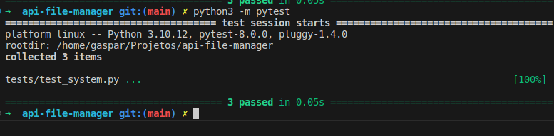
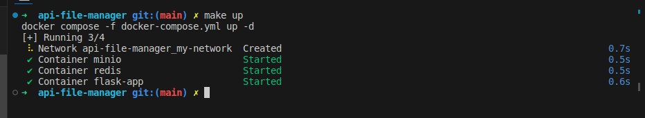
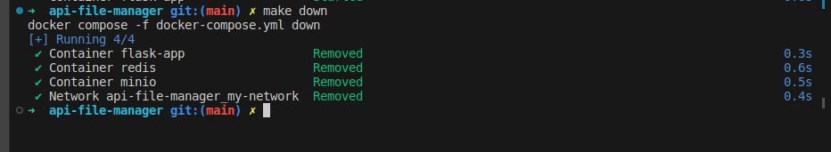
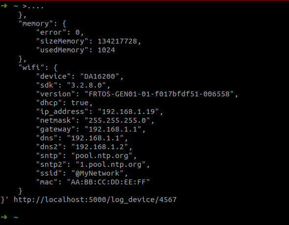

# API File Manager com Flask ,MinIO e Redis

## Descrição
Esta é uma API criada com Flask para cadastrar, listar e obter imagens. As imagens são armazenadas no MinIO, um serviço de armazenamento de objetos.

## Features Novas
 - Cadastrar Dados de device 
 - consultas de dados e logs 
 


## Gerencfiando Ambiente
---

```bash
make up
```


--- 

```bash
make down 
```


## Rotas
### Consulta de Device
**Exemplo de uso:**
```bash

curl -X GET http://localhost:5000/get_config/123

```


## Cadastro de Device
**Exemplo de uso:**
```bash

curl -X POST -H "Content-Type: application/json" -d '{
    "app": {
        "timestamp": 1706016312,
        "fwVersion": "v1.3.0",
        "hwVersion": "v1.0.0",
        "serialNumber": "0x1231237894579834857938457"
    },
    "accelerometer": {
        "enable": true,
        "error": 0,
        "x": 10,
        "y": 10,
        "z": 10,
        "vibrationDetect": true
    },
    "infra_red": {
        "enable": true,
        "error": 0,
        "humanDetect": false
    },
    "battery": {
        "enable": true,
        "error": 0,
        "accumulatedCapacity": 2000,
        "temperature": 25,
        "voltage": 330,
        "batteryStatus": 10,
        "batteryAlert": 100,
        "current": 100,
        "scaled_r": 10,
        "measured_z": 20,
        "internalTemperature": 30,
        "stateOfHealth": 3,
        "designCapacity": 5,
        "cal_count": 10,
        "cal_current": 100,
        "cal_voltage": 1000,
        "cal_temperature": 10000
    },
    "camera": {
        "error": 0
    },
    "memory": {
        "error": 0,
        "sizeMemory": 134217728,
        "usedMemory": 1024
    },
    "wifi": {
        "device": "DA16200",
        "sdk": "3.2.8.0",
        "version": "FRTOS-GEN01-01-f017bfdf51-006558",
        "dhcp": true,
        "ip_address": "192.168.1.19",
        "netmask": "255.255.255.0",
        "gateway": "192.168.1.1",
        "dns": "192.168.1.1",
        "dns2": "192.168.1.2",
        "sntp": "pool.ntp.org",
        "sntp2": "1.pool.ntp.org",
        "ssid": "@MyNetwork",
        "mac": "AA:BB:CC:DD:EE:FF"
    }
}' http://localhost:5000/log_device/123


```

### Cadastrar uma imagem
Endpoint: `/cadastrar` (método POST)

Cadastra uma nova imagem no MinIO.

**Exemplo de uso:**
```bash
curl -X POST -F "image=@/caminho/do/seu/arquivo/imagem.jpg" http://localhost:5000/cadastrar

```

### Listar Imagens
Endpoint: `/listar` (método GET)

Cadastra uma nova imagem no MinIO.

**Exemplo de uso:**
```bash
curl http://localhost:5000/listar

```

### Obter uma imagem específica

Endpoint: `/get_image/<bucket>/<path:image_path>` (método GET)

Obtém uma imagem específica do MinIO.

**Exemplo de uso:**

```bash
curl -O http://localhost:5000/get_image/seu-bucket/folder/nome-da-imagem.jpg
```
